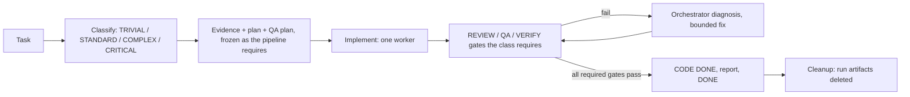

# Deterministic Agent Workflow Example

A small, Git-backed reference for deterministic coding-agent control shared by Codex and Claude Code. It aims for engineering determinism: the same repository state, task, frozen evidence, frozen plan, policy, and checks should lead to the same observable acceptance result.

A deterministic **orchestrator** classifies each task, selects a pipeline, and drives **bounded specialist roles** (Explorer, Architect, QA, Implementer, Reviewer, Verifier) through explicit artifacts and independent quality gates. It is not a swarm: no recursive delegation, one implementation worker, bounded remediation, and temporary run state that is deleted at completion. The canonical workflow is [.agents/WORKFLOW.md](.agents/WORKFLOW.md).



## Start a normal application task

Codex starts at [AGENTS.md](AGENTS.md); Claude Code starts at [CLAUDE.md](CLAUDE.md). Both resolve the same active run:

```sh
./scripts/agent.sh effective
./scripts/agent.sh status
```

For a new run, create `.agents/runs/<TASK-ID>/` from the templates (`RUN.yaml`, `TASK.md`, `PLAN.md`; `EVIDENCE.md` and `QA_PLAN.md` only where the class requires them), set `ACTIVE_RUN`, read its TASK, **classify** it, then establish the task branch and capture the task-start baseline before DISCOVER:

```sh
./scripts/agent.sh classify <TASK-ID> <TRIVIAL|STANDARD|COMPLEX|CRITICAL> [review]
./scripts/agent.sh pipeline <TASK-ID>     # what this run requires: artifacts, gates, explorer bound
./scripts/agent.sh branch <TASK-ID>
./scripts/agent.sh baseline <TASK-ID>
```

| Class | Evidence | Architect | QA plan + QA gate | REVIEW gate | VERIFY gate |
|---|---|---|---|---|---|
| TRIVIAL | no | no | no | no | yes |
| STANDARD | yes | no | yes | opt-in | yes |
| COMPLEX | yes | yes | yes | yes | yes |
| CRITICAL | yes | yes | yes | yes | yes |

The classification criteria and role boundaries are in `.agents/WORKFLOW.md`. Then DISCOVER read-only, build the pipeline's artifacts (declaring a `tdd_exemption` per scope path only when RED/GREEN genuinely does not apply), freeze and verify freshness, implement, and let the independent roles record their gates against the exact final tree. `CODE_DONE` is local completion only; use the local delivery gate before any separately authorized provider action. The knowledge transaction (`/wiki-ingest`, `/wiki-lint`) is optional and runs only when the task changed a durable project contract.

```sh
./scripts/agent.sh freeze <TASK-ID>
./scripts/agent.sh verify-freeze <TASK-ID>
./scripts/agent.sh freshness <TASK-ID>
./scripts/agent.sh verify-scope <TASK-ID>
./scripts/agent.sh verify-worker-evidence <TASK-ID>
./scripts/agent.sh gate <TASK-ID> <REVIEW|QA|VERIFY> <pass|fail>   # as independent_reviewer / independent_qa / independent_verifier
./scripts/agent.sh verify-handoff <TASK-ID>
./scripts/agent.sh delivery-check <TASK-ID>
```

### Execution topology: standalone vs. orchestrated

For a run created from the templates (`RUN.yaml` carries `worker_evidence:`/`tdd:`/`completion_report:`/`lifecycle_gates:`), `agent.sh resolve_topology` decides *how* implementation happens — not Claude, not Codex, not this reference repository unconditionally:

```sh
./scripts/agent.sh effective <TASK-ID>   # includes the resolved execution topology
```

- **`standalone`** (this repository's own default — see `.agents/config.yaml`) — the active `full_lifecycle` agent, whichever it is, implements RED/GREEN itself and records that evidence under its own role:
  ```sh
  printf 'command: <test command>\ntarget: <scope path>\nexpected_failure: <specific reason>\n' \
    | ./scripts/agent.sh worker-evidence <TASK-ID> RED fail
  # ... implement ...
  printf 'command: <test command>\ntarget: <scope path>\n' | ./scripts/agent.sh worker-evidence <TASK-ID> GREEN pass
  ```
  No `implementation_worker` delegation happens or is required; `agent.sh handoff <TASK-ID> IMPLEMENTED` still requires this RED+GREEN pair (or a validated `tdd_exemption`) — standalone is never a way to skip TDD, only a way to skip *delegation*.
- **`orchestrated`** — `full_lifecycle` cannot advance past IMPLEMENT by editing application files itself; `agent.sh handoff <TASK-ID> IMPLEMENTED` requires recorded `implementation_worker` RED+GREEN (or a validated `tdd_exemption`) evidence per scope path, authored by that role specifically. Invoke that worker the one canonical way this repository wires (its own Codex adapter — a different consuming project may wire a different tool the same way):
  ```sh
  ./scripts/worker-run.sh <TASK-ID> RED  --network not-required --prompt-file <prompt.md>
  ./scripts/worker-run.sh <TASK-ID> GREEN --network not-required --prompt-file <prompt.md>
  ```
  `worker-run.sh` shells out to the real `codex exec` CLI with `AGENT_ROLE=implementation_worker` set for that subprocess only, and refuses to run at all against a `standalone`-topology run; a missing `codex` binary or a non-zero exit is a hard failure — it never falls back to `full_lifecycle` implementing the change itself. Declare `--network required` only when EVIDENCE.md already established the task needs it (e.g. resolving a new dependency); a wrong guess wastes a whole invocation, because the sandbox's network access is fixed for that invocation. Model and reasoning effort are read from the operator's own `~/.codex/config.toml` unless `--model`/`--effort` is passed explicitly — this repository does not pin a model. The prompt given to Codex must instruct it to record its own evidence as it goes, using the same `agent.sh worker-evidence` invocation shown above.

A run selects its topology by setting `RUN.yaml`'s `execution.topology` to `standalone` or `orchestrated`; omitting it inherits `.agents/config.yaml`'s `default_topology`. See `.agents/WORKFLOW.md`'s "Execution topology" section for the full generic semantics.

### Task completion

`CODE_DONE` is local code completion, not task completion. Before a policy-enforced run can reach `DONE`, and then be cleaned up:

```sh
./scripts/agent.sh knowledge-done <TASK-ID> [not_applicable]   # not_applicable unless a durable contract changed
# .agents/runs/<TASK-ID>/COMPLETION_REPORT.md written (see required sections
# in .agents/WORKFLOW.md), derived from actual run evidence, never fabricated
./scripts/agent.sh publish-completion-report <TASK-ID> [ADAPTER]
./scripts/agent.sh verify-completion-report <TASK-ID>
./scripts/agent.sh handoff <TASK-ID> DONE
./scripts/agent.sh delivery-check <TASK-ID>
./scripts/agent.sh cleanup <TASK-ID>      # deletes .agents/runs/<TASK-ID>/ and clears ACTIVE_RUN; then stop
```

A run that cannot finish ends with `./scripts/agent.sh terminate <TASK-ID> FAILED|BLOCKED` (reason and evidence on stdin), never a loop.

The default `markdown` adapter (`.agents/task-integrations/markdown.sh`) publishes into the task's own `task_source.path` file; a different task system implements the same two-operation `publish`/`verify` contract (`.agents/task-integrations/README.md`) without any change to `agent.sh` itself.

The checked-in template intentionally leaves `.agents/ACTIVE_RUN` empty. `status` then reports `active_task=none` and implementation is blocked. The YAML policy in `.agents/modes/` (what a session may do) and the `pipelines:` table in `.agents/config.yaml` (what each class requires) are machine-readable; the shared Markdown files explain the rules. Templates for the next run live in `.agents/templates/`. `.agents/runs/` is temporary working state and is gitignored.

Deterministic does not mean loading everything: TASK and current repository/tests are the default context. Load detailed control guidance and wiki pages only when the current evidence is insufficient; wiki traversal starts at the index and never bulk-loads the graph.

## Capability and knowledge boundaries

vibecosystem is a capability provider, not the workflow owner. This reference adapts inspected `core` capabilities, including `luna_worker`, `code-reviewer`, and `verifier`; profile means what exists, while mode means what may run.

The LLM Wiki is plain Markdown with Obsidian-style wikilinks. Obsidian is optional. In Transaction A, use `/wiki-query`-style retrieval read-only and freeze selected references into EVIDENCE: no filed-back synthesis, log, index, entity, concept, decision, or lesson writes. If knowledge is missing, amend and re-freeze.

Transaction B is optional: only when a task changes a durable project contract or documented architecture, after CODE DONE, use the user’s existing `/wiki-ingest` and `/wiki-lint` workflow to update sourced project knowledge, log actual wiki operations, and resolve lint findings. Run artifacts are never promoted into the wiki wholesale. The local `wiki-lint.sh` is only a small CI-friendly structural example; it does not replace `/wiki-lint`.

See [.agents/ENFORCEMENT.md](.agents/ENFORCEMENT.md) for script-enforced, workflow-enforced, platform-enforced, and policy-only boundaries.

## Run the included example

```sh
./scripts/verify.sh
./scripts/agent.sh test     # fixture, lifecycle, branch, policy, standalone, knowledge and wiki suites (several minutes)
./scripts/agent.sh effective
./scripts/agent.sh status
./scripts/wiki-lint.sh
```

The example application (`src/`, `tests/`) is a small task registry that provides realistic repository context; the workflow itself is exercised by `./scripts/agent.sh test`, which builds throwaway repositories, so this repository carries no demonstration run.

## Adopt in another repository

1. Copy and adapt `AGENTS.md`, `CLAUDE.md`, `.agents/`, and `scripts/agent.sh`.
2. Adapt `scripts/verify.sh`, engineering guidance, and verification rules to the real stack.
3. Keep `ACTIVE_RUN` empty initially; create and explicitly activate the first real task run.
4. Initialize/adapt `docs/wiki/` with the existing LLM Wiki skill, then use `/wiki-ingest` only after CODE DONE.

vibecosystem remains external capability infrastructure: adapt its installed capabilities; do not copy or reimplement it.

## Maintaining this template

Normal application tasks use the workflow. Explicit user-requested maintenance of this control-plane/example repository may update the template directly without creating another demonstration run. Git history records those template changes.
