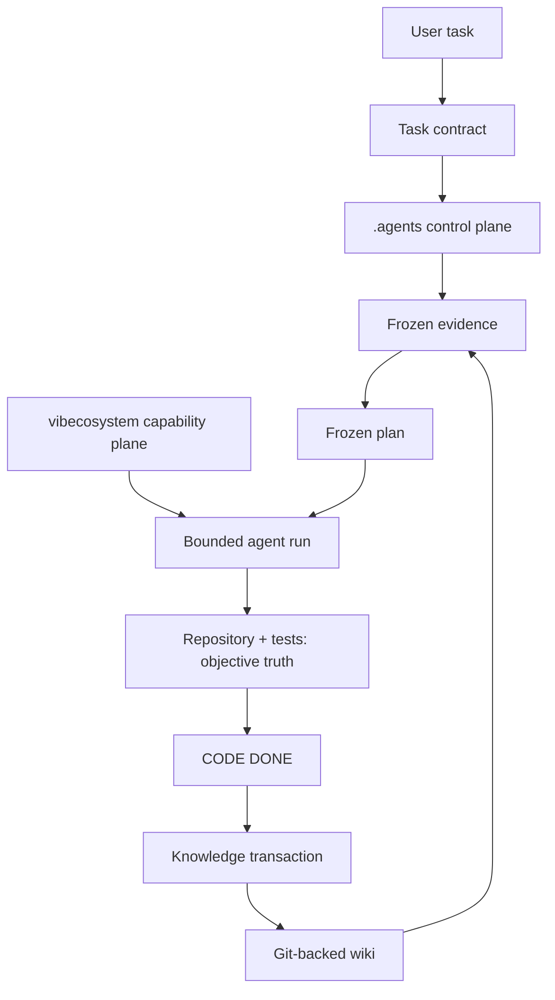

# Deterministic Agent Workflow Golden Reference

This repository demonstrates engineering determinism for Codex and Claude Code. It does not promise identical model text; it makes the task contract, evidence, plan, policy, scope, and acceptance gates inspectable and reproducible.



## Start a task

### Codex

Read `AGENTS.md`, then run:

```sh
./scripts/agent-policy.sh effective
./scripts/agent-run.sh status
```

Read the resolved run’s TASK/EVIDENCE/PLAN. DISCOVER is read-only. IMPLEMENT requires:

```sh
./scripts/agent-run.sh verify-freeze <TASK-ID>
./scripts/check-scope.sh --validate-plan <TASK-ID>
```

### Claude Code

Read `CLAUDE.md` and follow the same commands and gates. Claude conveniences, hooks, memory, persistent planning, and subagents are subordinate to the shared policy; `.agents/runs/<TASK>/PLAN.md` outranks mutable `thoughts/` files.

## Selection, freeze, and enforcement

`.agents/ACTIVE_RUN` contains exactly one task ID. A missing, malformed, or unresolved value blocks implementation. `.agents/modes/*.yaml` is the machine policy; Markdown explains it. Freeze hashes cover TASK, EVIDENCE, PLAN, and mode policy:

```sh
./scripts/agent-run.sh freeze EXAMPLE-001
./scripts/agent-run.sh verify-freeze EXAMPLE-001
./scripts/agent-run.sh validate EXAMPLE-001
./scripts/check-scope.sh EXAMPLE-001
```

An amendment is explicit under `amendments/`; it records why evidence/plan changed, then `refreeze` requires that artifact. The frozen plan frontmatter maps every authorized path to acceptance IDs.

## Capability and knowledge planes

vibecosystem provides actual bounded capabilities, not workflow authority. This example uses its inspected v3.4.0 `core` profile and documents `luna_worker`, `code-reviewer`, `verifier`, and allowed skills in `.agents/VIBECOSYSTEM.md`. Profile means available capabilities; mode means permitted behavior.

The LLM Wiki is plain Markdown with Obsidian-style wikilinks; Obsidian only adds navigation. Transaction A reads a bounded wiki traversal and freezes references into evidence. Transaction B begins only after CODE DONE and writes factual sessions, decisions/lessons, log entries, then runs lint.

## What is actually enforced?

See [the enforcement matrix](.agents/ENFORCEMENT.md). Hashes, active task, scope mappings, required artifacts, checks, and wiki structure are script-enforced. Globally installed memory/recall/prompt-improvement/swarm hooks are policy-only from this repository’s perspective unless the host disables them.

## Run the demonstration

```sh
./scripts/verify.sh
./scripts/control-plane-test.sh
./scripts/agent-policy.sh effective
./scripts/agent-run.sh validate EXAMPLE-001
./scripts/agent-run.sh verify-freeze EXAMPLE-001
./scripts/check-scope.sh EXAMPLE-001
./scripts/wiki-lint.sh
```

To create EXAMPLE-002: copy templates, make it the sole ACTIVE_RUN, complete read-only DISCOVER, freeze its contract, implement only mapped scope, record independent review/verifier evidence, then write knowledge only after CODE DONE.

