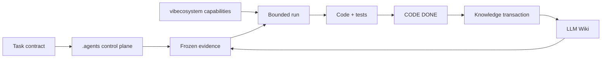

# Deterministic Agent Workflow Example

A small, Git-backed reference for deterministic coding-agent control shared by Codex and Claude Code. It aims for engineering determinism: the same repository state, task, frozen evidence, frozen plan, policy, and checks should lead to the same observable acceptance result.



## Start a normal application task

Codex starts at [AGENTS.md](AGENTS.md); Claude Code starts at [CLAUDE.md](CLAUDE.md). Both resolve the same active run:

```sh
./scripts/agent.sh effective
./scripts/agent.sh status
```

Read its TASK, EVIDENCE, PLAN, then DISCOVER read-only. IMPLEMENT requires a valid freeze and plan mapping:

```sh
./scripts/agent.sh freeze <TASK-ID>
./scripts/agent.sh verify-freeze <TASK-ID>
./scripts/agent.sh verify-scope <TASK-ID>
```

The checked-in template intentionally leaves `.agents/ACTIVE_RUN` empty. `status` then reports `active_task=none` and implementation is blocked. A real application task explicitly sets exactly one existing run ID, records its dirty-worktree baseline, then proceeds:

```sh
./scripts/agent.sh baseline <TASK-ID>
./scripts/agent.sh freeze <TASK-ID>
```

The YAML policy in `.agents/modes/` is machine-readable; the shared Markdown files explain the rules. Templates for the next run live in `.agents/templates/`.

## Capability and knowledge boundaries

vibecosystem is a capability provider, not the workflow owner. This reference adapts inspected `core` capabilities, including `luna_worker`, `code-reviewer`, and `verifier`; profile means what exists, while mode means what may run.

The LLM Wiki is plain Markdown with Obsidian-style wikilinks. Obsidian is optional. In Transaction A, use `/wiki-query`-style retrieval read-only and freeze selected references into EVIDENCE: no filed-back synthesis, log, index, entity, concept, decision, or lesson writes. If knowledge is missing, amend and re-freeze.

In Transaction B, after CODE DONE, use the user’s existing `/wiki-ingest` and `/wiki-lint` workflow to update sourced project knowledge, log actual wiki operations, and resolve lint findings. The local `wiki-lint.sh` is only a small CI-friendly structural example; it does not replace `/wiki-lint`.

See [.agents/ENFORCEMENT.md](.agents/ENFORCEMENT.md) for script-enforced, workflow-enforced, platform-enforced, and policy-only boundaries.

## Run the included example

```sh
./scripts/verify.sh
./scripts/agent.sh test
./scripts/agent.sh effective
./scripts/agent.sh status
./scripts/agent.sh validate EXAMPLE-001
./scripts/agent.sh verify-freeze EXAMPLE-001
./scripts/wiki-lint.sh
```

EXAMPLE-001 is a small task-registry lookup feature with frozen evidence, plan scope, review, verifier, and result artifacts. It predates task-start baselines, so its scope check is intentionally unavailable as historical reference evidence.

## Adopt in another repository

1. Copy and adapt `AGENTS.md`, `CLAUDE.md`, `.agents/`, and `scripts/agent.sh`.
2. Adapt `scripts/verify.sh`, engineering guidance, and verification rules to the real stack.
3. Keep `ACTIVE_RUN` empty initially; create and explicitly activate the first real task run.
4. Remove `EXAMPLE-001` when it is no longer useful as local documentation, or retain it only as a reference.
5. Initialize/adapt `docs/wiki/` with the existing LLM Wiki skill, then use `/wiki-ingest` only after CODE DONE.

vibecosystem remains external capability infrastructure: adapt its installed capabilities; do not copy or reimplement it.

## Maintaining this template

Normal application tasks use the workflow. Explicit user-requested maintenance of this control-plane/example repository may update the template directly without creating another demonstration run. Git history records those template changes; `.agents/runs/` stays focused on meaningful examples.
