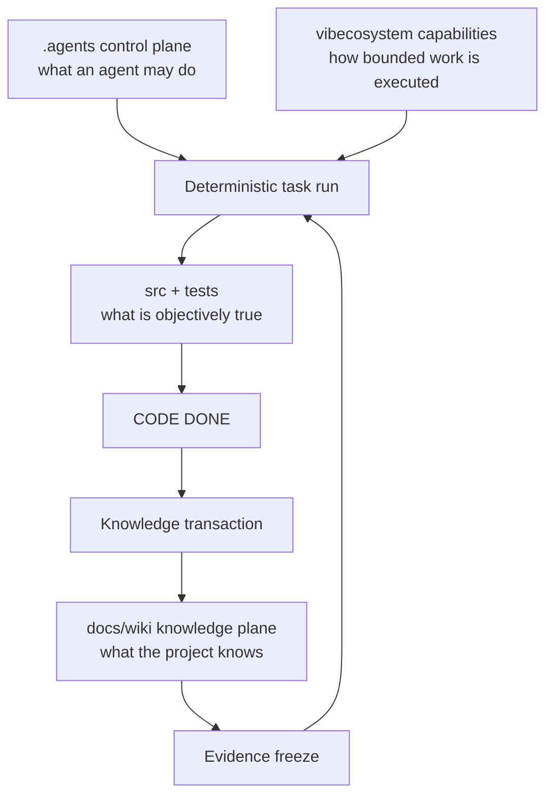

# Deterministic AI Coding-Agent Workflow Example

This repository is a working reference for a shared Codex and Claude Code control architecture, not a business application. It separates permission and process from knowledge and objectively executable code.



## Four layers

- `.agents` answers **what an agent is allowed to do**: state gates, scope, and proof.
- vibecosystem is an optional capability provider answering **how work is executed**.
- `docs/wiki` answers **what this project already knows**, using Git-backed Markdown and wikilinks.
- `src` and `tests` answer **what is objectively true now**.

Codex begins with [AGENTS.md](AGENTS.md); Claude Code begins with [CLAUDE.md](CLAUDE.md). Both route to the same detailed rules, so behavior is consistent without duplicating instructions. Obsidian can visualize the wiki but is optional: all links are plain Markdown and `scripts/wiki-lint.sh` works without it.

## Modes and capabilities

`deterministic` is for bounded implementation: frozen evidence and plan, allowlisted skills, one implementation worker by default, and mandatory verification. `explore` permits broad research but cannot edit application code; `review` is read-heavy and requires an explicit fix task before writes. A **profile** (such as `core` or `backend`) says which capabilities exist; a **mode** says how those capabilities may behave. See `.agents/modes/` and `docs/architecture.md`.

## Exercise EXAMPLE-001

The completed example run is under `.agents/runs/EXAMPLE-001/`. To inspect its contract and re-run its checks:

```bash
./scripts/verify.sh
./scripts/wiki-lint.sh
./scripts/check-scope.sh .agents/runs/EXAMPLE-001/PLAN.md
```

For a new task, copy `TASK_TEMPLATE.md`, do read-only DISCOVER, create and freeze `EVIDENCE.md`, create and freeze `PLAN.md`, implement only planned files, then verify/review. After CODE DONE, write a factual raw session summary, ingest any new decision or lesson, append `docs/wiki/log.md`, and lint the wiki. A task cannot rewrite its own past: after completion it may become history for future tasks.

