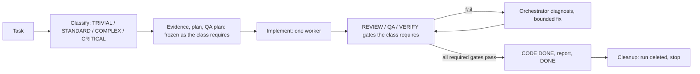

# Deterministic Agent Workflow Example

A small, Git-backed reference for deterministic coding-agent control shared by Codex and Claude Code. It aims for engineering determinism: the same repository state, task, frozen artifacts, policy and checks should lead to the same observable acceptance result.

A deterministic **orchestrator** classifies each task, selects a pipeline, and drives **bounded specialist roles** (Explorer, Architect, QA, Implementer, Reviewer, Verifier) through explicit artifacts and independent quality gates. It is not a swarm: no recursive delegation, one implementation worker, bounded remediation, and run state that is deleted at completion. The canonical workflow is [.agents/WORKFLOW.md](.agents/WORKFLOW.md); what is script-enforced versus policy-only is in [.agents/ENFORCEMENT.md](.agents/ENFORCEMENT.md); the layered model is in [docs/agent-control-plane.md](docs/agent-control-plane.md).



## Use it

Codex starts at [AGENTS.md](AGENTS.md); Claude Code starts at [CLAUDE.md](CLAUDE.md). Both follow the same protocol. You state intent in **one sentence**; the repository owns the lifecycle, delegation, verification, cleanup and stop conditions:

```text
Work on docs/project/tasks/TODO-001.md.
Add a DELETE /api/v1/todos/{id} endpoint that returns 204, or 404 for an unknown id.
Continue TODO-001.
```

The agent resumes or creates the run, classifies the task, freezes what the class requires, implements through a single worker, passes independent gates, publishes the completion report, cleans up the run and stops. Commit, push and PR need your separate, explicit authorization. More prompts (English and Turkish) and the day-to-day flow: [docs/guides/AGENT-SESSION-VE-PROMPT-REHBERI.md](docs/guides/AGENT-SESSION-VE-PROMPT-REHBERI.md).

| Class | Evidence | Architect | QA plan + QA gate | REVIEW gate | VERIFY gate |
|---|---|---|---|---|---|
| TRIVIAL | no | no | no | no | yes |
| STANDARD | yes | no | yes | opt-in | yes |
| COMPLEX | yes | yes | yes | yes | yes |
| CRITICAL | yes | yes | yes | yes | yes |

Classification criteria, role boundaries, freezes, remediation (2 bounded fixes) and artifact ownership are in `.agents/WORKFLOW.md`; `./scripts/agent.sh pipeline <TASK-ID>` prints what a run requires.

## Repository-owned state

| Durable (committed) | Disposable |
|---|---|
| `AGENTS.md`, `CLAUDE.md`, `.agents/` rules, modes, templates, config | `.agents/runs/<TASK-ID>/` (gitignored) |
| Task sources, code and tests, `docs/wiki/` (only for durable contract changes) | Evidence, plans, QA/review/verify reports, gate records, ledger |

The checked-in `.agents/ACTIVE_RUN` is empty: `./scripts/agent.sh status` reports `active_task=none` and implementation is blocked until one valid run is active. After `DONE`, `delivery-check` and `cleanup`, the run directory is deleted; the published completion report in the task source and Git history are the record. A run that cannot finish ends with `terminate FAILED|BLOCKED`, never a loop.

## Execution topology

`agent.sh` resolves how implementation happens from `RUN.yaml`'s `execution.topology`, else `.agents/config.yaml`'s `default_topology` (this repository defaults to `standalone`; an invalid value on both fails closed):

- **`standalone`** — the `full_lifecycle` agent implements RED/GREEN itself and records that evidence under its own role.
- **`orchestrated`** — the orchestrator never implements application code; RED/GREEN/fixes belong to `implementation_worker`, invoked only through `scripts/worker-run.sh` (Codex, `codex exec`). A missing `codex` or a failed run is a hard failure, never a fallback. Model and reasoning effort come from the operator's Codex config unless `--model`/`--effort` is passed; declare `--network required` only when the task's evidence established it.

In both, `agent.sh handoff <TASK-ID> IMPLEMENTED` requires RED and GREEN evidence per scope path (or a validated `tdd_exemption`) from the role the topology expects.

## Completion

`CODE_DONE` is local code completion only. `DONE` additionally requires the knowledge step (`not_applicable` unless a durable contract changed), a completion report derived from run evidence, and its publication through a task-integration adapter (the default `markdown` adapter writes into the task's own file; the contract is in [.agents/task-integrations/README.md](.agents/task-integrations/README.md)). The optional knowledge transaction updates `docs/wiki/` with `/wiki-ingest` and `/wiki-lint` after CODE DONE; run artifacts are never promoted wholesale.

## Try the included example

```sh
./scripts/verify.sh            # go build, test, vet
./scripts/agent.sh test        # control-plane self-tests: fixture, lifecycle, branch, policy, standalone, knowledge, wiki (several minutes)
./scripts/agent.sh status
./scripts/wiki-lint.sh
```

`src/` and `tests/` are a small task-registry example that gives the workflow realistic repository context. This repository carries no demonstration run; `agent.sh test` exercises the workflow in throwaway repositories.

## Guides

- [Agent Session ve Prompt Rehberi](docs/guides/AGENT-SESSION-VE-PROMPT-REHBERI.md): daily usage, roles, gates, cleanup, prompt catalog (EN/TR).
- [Todo App Uygulama Rehberi](docs/guides/TODO-APP-KULLANIM-REHBERI.md): adapting the control plane to a real project.
- [Linear](docs/guides/TODO-APP-LINEAR-ORNEGI.md) and [Markdown](docs/guides/TODO-APP-MARKDOWN-PROJE-YONETIMI.md) task management; [entegrasyon checklist'i](docs/guides/YENI-PROJE-ENTEGRASYON-CHECKLIST.md).

## Adopt in another repository

1. Copy and adapt `AGENTS.md`, `CLAUDE.md`, `.agents/`, `scripts/agent.sh`, `scripts/worker-run.sh`, `scripts/wiki-lint.sh`.
2. Adapt `scripts/verify.sh`, `.agents/ENGINEERING.md` and `.agents/VERIFICATION.md` to the real stack; set `default_topology` in `.agents/config.yaml`.
3. Keep `ACTIVE_RUN` empty and `.agents/runs/` gitignored; start the first task with one sentence.
4. Initialize `docs/wiki/` with the existing LLM Wiki skill; use `/wiki-ingest` only after CODE DONE, and only for durable knowledge.

vibecosystem stays external capability infrastructure: profile means what exists, mode means what may run; this reference adapts inspected `core` capabilities (`code-reviewer`, `verifier`, `luna_worker`) without copying them.

## Maintaining this template

Normal application tasks use the workflow. Explicit, user-requested maintenance of the control plane may update files directly without creating a run; Git history records those changes.
