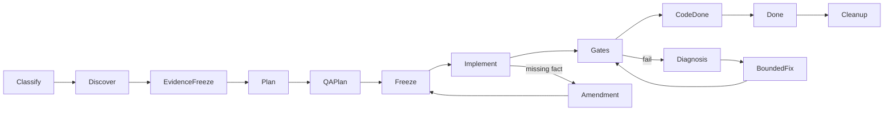

# Agent control plane architecture

## Layers

| Layer | Owns | Does not own |
|---|---|---|
| CONTROL PLANE: `.agents` | permission, state machine, hashes, scope, stop gates | agent capability inventory or project facts |
| CAPABILITY PLANE: vibecosystem | available skills, roles, hooks, workers | task scope or workflow authority |
| KNOWLEDGE PLANE: `docs/wiki` | sourced project knowledge and history | canonical truth or active instructions |
| OBJECTIVE REPOSITORY STATE | code, tests, build/static results | rationale for work |
| OVERSIGHT: `scripts/oversight` (sh + awk) | read-only projection of run state: CLI summary, HTML report, diagrams, optional workflow events | truth, evidence, gates |

Engineering determinism means the same repository SHA, contract, frozen evidence, frozen plan, policy/capability set, and verification commands produce the same observable acceptance result—not identical model prose.

## Invariants

- profile != mode: profile exposes capabilities; mode limits their behavior.
- task != execution plan: task says requested outcome; frozen plan says authorized implementation boundary.
- wiki != canonical source: current code/tests and canonical docs outrank stale wiki interpretation.
- memory != evidence: recalled context cannot silently join frozen evidence.
- review != QA != verification: the Reviewer judges the code, QA judges behavior against the frozen QA plan, the Verifier mechanically proves the frozen plan was implemented — three independent gates, required per task classification.
- run state is disposable: `.agents/runs/<ID>/` is temporary working state, deleted at completion; permanent knowledge is source code, workflow contracts and (rarely) the wiki.
- presentation != truth: the oversight model, summary and report project run state for humans. They are not evidence, hold no fact run state lacks, and never gate a task (`.agents/OVERSIGHT.md`).
- CODE DONE != KNOWLEDGE DONE: source knowledge is written only in Transaction B.

Which of Discover/Evidence/QA plan/Review/QA/Verify apply is decided by the classification (TRIVIAL, STANDARD, COMPLEX, CRITICAL); see `.agents/WORKFLOW.md`.

## Transactions

Transaction A: `TASK → CLASSIFY → DISCOVER → WIKI READ → EVIDENCE FREEZE → PLAN/QA PLAN FREEZE → IMPLEMENT → GATES → CODE DONE`. Wiki writes are forbidden.

Transaction B (optional — only when a durable project contract changed): `CODE RESULT → FACTUAL SUMMARY → WIKI INGEST → DECISIONS/LESSONS → LOG → WIKI LINT → KNOWLEDGE DONE`. Otherwise `knowledge-done not_applicable`.

A task cannot rewrite its own past. After completion, it may become history for future tasks.
