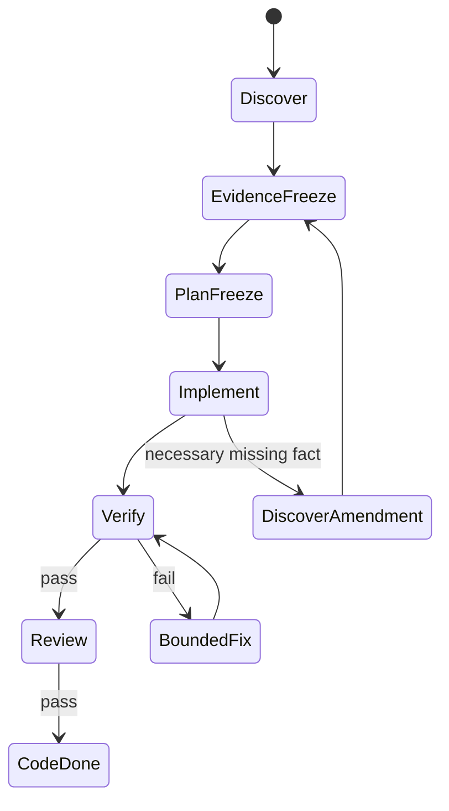

# Architecture

## Layers

| Layer | Owns | Does not own |
|---|---|---|
| CONTROL PLANE: `.agents` | permission, state machine, hashes, scope, stop gates | agent capability inventory or project facts |
| CAPABILITY PLANE: vibecosystem | available skills, roles, hooks, workers | task scope or workflow authority |
| KNOWLEDGE PLANE: `docs/wiki` | sourced project knowledge and history | canonical truth or active instructions |
| OBJECTIVE REPOSITORY STATE | code, tests, build/static results | rationale for work |

Engineering determinism means the same repository SHA, contract, frozen evidence, frozen plan, policy/capability set, and verification commands produce the same observable acceptance result—not identical model prose.

## Invariants

- profile != mode: profile exposes capabilities; mode limits their behavior.
- task != execution plan: task says requested outcome; frozen plan says authorized implementation boundary.
- wiki != canonical source: current code/tests and canonical docs outrank stale wiki interpretation.
- memory != evidence: recalled context cannot silently join frozen evidence.
- review != verification: reviewer evaluates code/scope; verifier reruns required gates.
- CODE DONE != KNOWLEDGE DONE: source knowledge is written only in Transaction B.

## Transactions

Transaction A: `TASK → DISCOVER → WIKI READ → EVIDENCE FREEZE → PLAN FREEZE → IMPLEMENT → VERIFY → REVIEW → CODE DONE`. Wiki writes are forbidden.

Transaction B: `CODE RESULT → FACTUAL SESSION SUMMARY → WIKI INGEST → DECISIONS/LESSONS → LOG → WIKI LINT → KNOWLEDGE DONE`.

A task cannot rewrite its own past. After completion, it may become history for future tasks.

